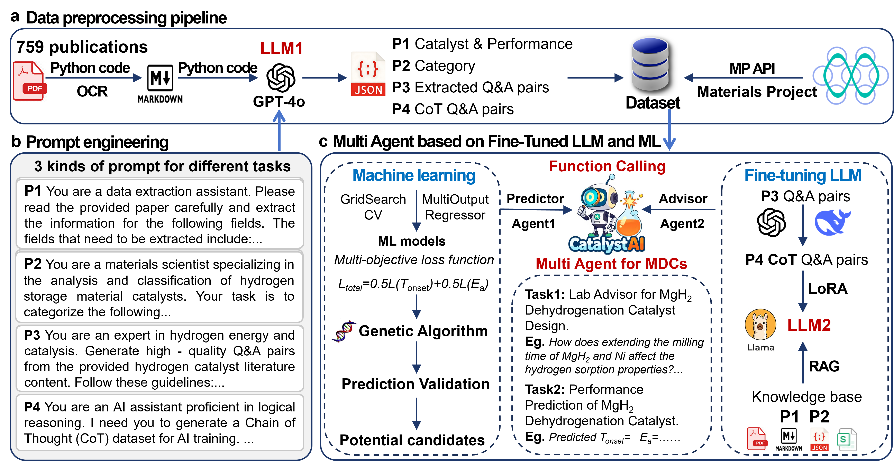

# LLM-Driven Machine Learning Framework for Catalyst Design of MgH<sub>2</sub> Dehydrogenation



An AI-driven framework for accelerating the discovery of high-performance MgH2 dehydrogenation catalysts, by combining Large Language Models (LLMs like GPT-4o and a fine-tuned DeepSeek variant) with Machine Learning (ML) algorithms, is presented. It efficiently extracts MgH2 catalyst experimental data from extensive literature and provides specialized, actionable recommendations for catalyst design via its multi-agent component, Cat-Advisor.

## Installation

```sh
git clone https://github.com/Weijie-Yang/cat_advisor
cd cat_advisor
```

For anaconda, create a new python environment:

```sh
conda create -n cat_advisor python=3.9.19
```

### Requirement

For **0_get_parameters** using LLMs:

```
openai=1.60.2
Nougat=0.1.17
mp-api=0.45.3
httpx=0.28.1
pandas=2.2.3
numpy=1.26.4

```

For **1_ml**:

```
xgboost=2.1.4
scikit-learn=1.5.2
pymatgen=2024.8.9
shap=0.46.0
openpyxl=3.1.5
joblib=1.4.2
```

For **2_lora**:

```
cd lora
pip install unsloth
```

### Online demo

You can try our model in [Online-Demo site](https://cat-advisor.cpolar.top/chat/share?shareId=wfz7t90zohng7vaej6b1dxgd). 


The associated Chain-of-Thought (CoT) dataset is publicly available on Hugging Face at [our CoT dataset](https://huggingface.co/datasets/Yy245/cot_2000). The fine-tuned DeepSeek-R1-Distill-Llama-8B model weights are publicly available on Hugging Face at [Cat-Advisor model](https://huggingface.co/Yy245/Cat-Advisor).


## Acknowledgments
This work uses data or services provided by the Materials Project, a project of the U.S. Department of Energy Basic Energy Sciences Program.
If you use data from the Materials Project, please cite:
A. Jain, S.P. Ong, G. Hautier, W. Chen, W.D. Richards, S. Dacek, S. Cholia, D. Gunter, D. Skinner, G. Ceder, and K.A. Persson, "The Materials Project: A materials genome approach to accelerating materials innovation", APL Materials 1, 011002 (2013). DOI: 10.1063/1.4812323
- [Nougat](https://github.com/facebookresearch/nougat)
- [unsloth](https://github.com/unslothai/unsloth)
- [ollama](https://github.com/ollama/ollama)
- [one-api](https://github.com/songquanpeng/one-api)
